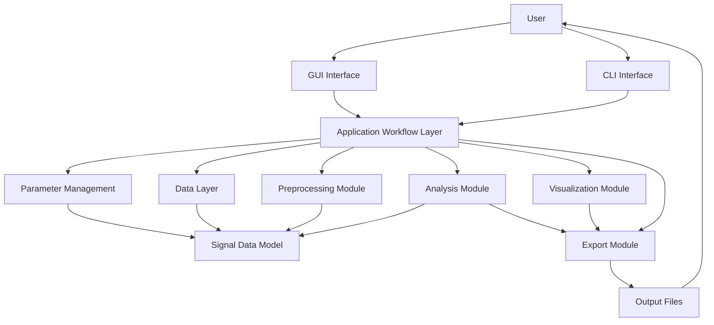
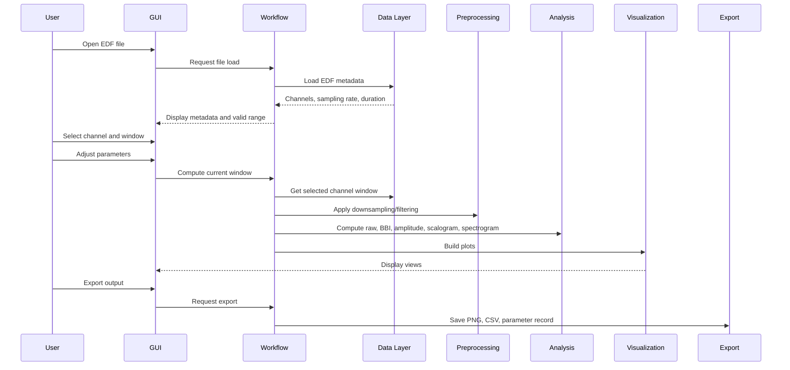
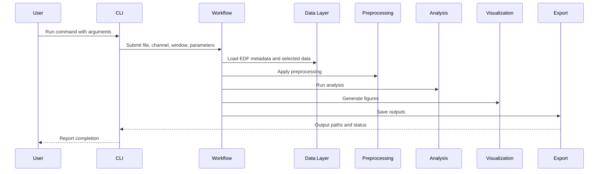

# EDFViewer High-Level Design Document

## 1. Purpose

This document describes the high-level design of EDFViewer based on the requirements defined in `Proposal.md`.

EDFViewer is a signal analysis tool for EDF files. It provides two official interfaces:

- A GUI version for interactive inspection, parameter adjustment, and figure export.
- A CLI version for reproducible scripted analysis and future batch processing.

The design goal is to keep GUI and CLI behavior consistent by sharing the same data loading, preprocessing, analysis, visualization, export, and validation modules wherever possible.

## 2. Design Scope

### 2.1 Current Scope

The current design supports analysis of one EDF file at a time.

The current design supports:

- EDF file input.
- Generic channel-based signal handling.
- Channel selection.
- Time-window selection.
- Downsampling.
- Filtering.
- Raw signal visualization.
- BBI visualization.
- Amplitude visualization.
- CWT scalogram visualization.
- STFT spectrogram visualization.
- PNG export.
- CSV feature export.
- Analysis parameter record export.
- Python source execution.
- macOS app packaging.

### 2.2 Future Scope

The following features are reserved for future versions and should not block the current design:

- GUI support for multiple EDF files with file switching.
- CLI batch processing across multiple EDF files.
- CSV input.
- MAT input.
- Windows executable packaging.
- Linux executable packaging.
- Optional PDF report generation.
- Additional adjustable analysis parameters.
- Additional feature extraction modules.

## 3. Architectural Overview

EDFViewer should use a modular architecture with shared core logic and separate user-facing interfaces.

The GUI and CLI should not duplicate analysis logic. Both interfaces should call the same core modules through the application workflow layer.

## 4. Module Decomposition

### 4.1 GUI Interface Module

The GUI interface module provides interactive workflows for laboratory researchers and clinical staff.

Responsibilities:

- Open one EDF file.
- Display EDF metadata and available channels.
- Allow channel selection.
- Show valid time range after file and channel selection.
- Allow window start and window length selection.
- Provide controls for analysis parameters.
- Trigger computation for the selected window.
- Display raw signal, BBI, amplitude, scalogram, and spectrogram views.
- Allow parameter adjustment during inspection.
- Trigger export actions.
- Display status messages and errors.

Required GUI controls:

- EDF file selector.
- Channel selector.
- Target sampling rate control.
- Window start control.
- Window length control.
- CWT wavelet selector.
- STFT window length control.
- Frequency range controls.
- Linear/log frequency axis control.
- Color scale and value range controls.
- Filtering parameter controls.
- Compute current window action.
- Save current tab PNG action.
- Future all-window or selected-window export action.

Main GUI views:

- `Signal + Scalogram`
- `Spectrogram`

`Signal + Scalogram` must support:

- Raw signal view paired with raw scalogram.
- BBI view paired with BBI scalogram.
- Amplitude view paired with amplitude scalogram.
- Shared value range when comparing raw, BBI, and amplitude scalograms within the same analysis context.

`Spectrogram` must support:

- STFT spectrogram display.
- Comparison with scalogram.
- Adjustable STFT window length.
- Adjustable frequency range.
- Linear/log frequency axis.
- Adjustable color scale and value range.

### 4.2 CLI Interface Module

The CLI interface module provides reproducible analysis without opening the GUI.

Responsibilities:

- Accept EDF input path.
- Accept channel selection.
- Accept time-window settings.
- Accept sampling-rate settings.
- Accept wavelet settings.
- Accept STFT window settings.
- Accept frequency range settings.
- Accept output directory settings.
- Run the same core analysis as the GUI where applicable.
- Save figures.
- Save CSV feature tables.
- Save analysis parameter records.

Current CLI design should focus on one EDF file per command.

Future CLI design should support batch processing of multiple EDF files.

### 4.3 Application Workflow Layer

The application workflow layer coordinates user actions and module calls.

Responsibilities:

- Receive requests from GUI or CLI.
- Validate required inputs.
- Create or update analysis parameter objects.
- Request data loading from the data layer.
- Request preprocessing operations.
- Request analysis computations.
- Send analysis results to visualization and export modules.
- Manage cached results for recently computed windows.
- Return clear success or error states to GUI or CLI.

This layer is the main boundary that keeps GUI and CLI behavior consistent.

### 4.4 Parameter Management Module

The parameter management module stores user-selected analysis settings.

Responsibilities:

- Store target sampling rate.
- Store window start.
- Store window length.
- Store selected channel.
- Store selected wavelet.
- Store STFT window length.
- Store frequency range.
- Store frequency-axis mode.
- Store color scale and value range.
- Store filtering parameters.
- Validate parameter ranges.
- Serialize parameters for export.

Parameter records should be exportable so that analysis results can be reproduced later.

### 4.5 Data Layer

The data layer manages EDF input and signal metadata.

Responsibilities:

- Open EDF files.
- Read channel names.
- Read sampling rate.
- Read signal duration.
- Read available data range.
- Provide selected channel data.
- Provide metadata needed for valid window selection.
- Support future extension to CSV and MAT input.

Current input format:

- EDF.

Future input formats:

- CSV.
- MAT.

The data layer should expose generic channel data. It should not require predefined signal types such as EEG, ECG, PPG, respiration, or blood pressure.

### 4.6 Signal Data Model

The signal data model represents the data passed between modules.

Required conceptual fields:

- Source file path.
- Channel name.
- Original sampling rate.
- Analysis sampling rate.
- Signal duration.
- Window start.
- Window length.
- Time vector.
- Signal values.
- Metadata required for export and reproducibility.

The signal data model should support selected-window analysis so large EDF files do not need to be fully visualized at once.

### 4.7 Preprocessing Module

The preprocessing module prepares selected signal windows for analysis.

Responsibilities:

- Downsampling.
- Antialiasing during downsampling.
- Low-pass filtering.
- High-pass filtering.
- Band-pass filtering.
- Filtering parameter validation.
- Future preprocessing extension.

The preprocessing module should operate on numerical arrays and should not depend on GUI-specific code.

### 4.8 Analysis Module

The analysis module computes signal features and time-frequency representations.

Responsibilities:

- Raw signal preparation.
- BBI computation.
- Amplitude computation.
- Time-domain feature computation.
- Frequency-domain feature computation.
- PSD computation.
- CWT scalogram computation.
- STFT spectrogram computation.
- Feature table generation.

Core analysis outputs:

- Raw signal data.
- BBI series.
- Amplitude series.
- Raw scalogram.
- BBI scalogram.
- Amplitude scalogram.
- Spectrogram.
- CSV-compatible feature table.

The analysis module should use `BBI` as the only user-facing beat-to-beat interval term.

### 4.9 Visualization Module

The visualization module converts analysis results into plots.

Responsibilities:

- Plot raw signal.
- Plot BBI.
- Plot amplitude.
- Plot CWT scalogram.
- Plot STFT spectrogram.
- Apply frequency range.
- Apply linear/log frequency-axis display.
- Apply color scale and value range.
- Keep plot axes labeled consistently.
- Prepare figure objects or widget views for export.

Visualization outputs should support:

- GUI display.
- PNG export.
- CLI-generated figures.

### 4.10 Export Module

The export module writes user-requested outputs to files.

Responsibilities:

- Export current GUI tab as PNG.
- Export all-window or selected-window PNG figures.
- Export CSV feature tables.
- Export analysis parameter records.
- Support output paths selected by GUI or CLI.
- Preserve enough metadata for reproducibility.

Current required exports:

- Current tab PNG.
- All-window or selected-window PNG.
- CSV feature table.
- Analysis parameter record.

Future export:

- Optional PDF report.

### 4.11 Packaging Module

The packaging module prepares runnable distributions.

Current packaging targets:

- Python source execution.
- macOS app.

Future packaging targets:

- Windows executable.
- Linux executable.

Packaging validation must include startup, EDF file opening, analysis execution, and PNG export.

### 4.12 Validation Module

The validation module verifies behavior against synthetic and real data.

Responsibilities:

- Validate synthetic EDF behavior using `samples/phantom.edf`.
- Validate real EDF loading.
- Validate channel listing.
- Validate window range calculation.
- Validate GUI workflow.
- Validate CLI workflow.
- Validate export outputs.
- Validate macOS app behavior.

Synthetic validation requirements:

- First 100 seconds: 1.5 Hz signal with 200 mV amplitude.
- Middle 100 seconds: 1.5 Hz signal with 100 mV amplitude.
- Final 100 seconds: 3 Hz signal with 100 mV amplitude.
- Scalogram and spectrogram should show the expected frequency change over time.

## 5. Module Relationships

### 5.1 Interface to Workflow Relationship

The GUI and CLI modules both depend on the application workflow layer.

The GUI should not call low-level analysis functions directly when the same action also exists in CLI.

The CLI should not reimplement GUI-only analysis behavior. It should request the same workflow operations with command-line parameters.

### 5.2 Workflow to Core Module Relationship

The application workflow layer depends on:

- Parameter management.
- Data layer.
- Preprocessing module.
- Analysis module.
- Visualization module.
- Export module.

Core modules should not depend on GUI widgets or CLI argument parsers.

### 5.3 Data to Preprocessing Relationship

The data layer provides selected channel data and metadata.

The preprocessing module receives selected signal arrays and parameter settings.

The preprocessing module returns processed arrays and updated sampling information.

### 5.4 Preprocessing to Analysis Relationship

The analysis module receives preprocessed window data.

The analysis module returns raw, BBI, amplitude, scalogram, spectrogram, and feature outputs.

### 5.5 Analysis to Visualization Relationship

The visualization module receives analysis outputs and display parameters.

The visualization module creates plots for GUI display or file export.

### 5.6 Analysis and Visualization to Export Relationship

The export module receives:

- Plot outputs from the visualization module.
- Feature outputs from the analysis module.
- Parameter records from parameter management.

The export module writes files for user review and reproducibility.

## 6. Core Data Flow

### 6.1 GUI Data Flow

### 6.2 CLI Data Flow

## 7. Key Design Decisions

### 7.1 Generic Channel-Based Analysis

EDFViewer should treat all EDF signals as generic channels. The system should not require predefined signal categories.

Reason:

- The proposal requires all signals to be handled by channel.
- EDF files may contain different channel names and signal types.
- BBI and amplitude can be core features without forcing every channel into a known physiological category.

### 7.2 Windowed Analysis for Large Files

EDFViewer should analyze selected windows instead of rendering or computing entire long recordings by default.

Reason:

- EDF files may include overnight recordings.
- Users need to select meaningful time windows.
- Windowed computation improves performance and usability.

### 7.3 Shared Core for GUI and CLI

The GUI and CLI should share core modules.

Reason:

- The proposal requires CLI and GUI functions to remain as consistent as possible.
- Shared modules reduce duplicated behavior.
- Shared parameter records improve reproducibility.

### 7.4 Explicit Parameter Records

Every exported analysis should be able to include a parameter record.

Reason:

- The proposal requires analysis parameter logging.
- Parameters such as wavelet, STFT window, frequency range, color range, and filters affect results.
- Reproducibility is important for research and clinical review.

### 7.5 Separate Current and Future Scope

Future functionality should be documented but kept separate from current implementation tasks.

Reason:

- The proposal explicitly separates current scope from future features.
- Current development should not be blocked by multi-file GUI support, CSV/MAT support, or cross-platform packaging.

## 8. Interface Contracts

This section defines conceptual contracts between modules. Exact function names may follow the existing codebase.

### 8.1 Data Layer Contract

Inputs:

- EDF file path.
- Selected channel.
- Optional window start.
- Optional window length.

Outputs:

- Channel list.
- Sampling rate.
- Signal duration.
- Valid time range.
- Selected channel signal data.
- Metadata.

### 8.2 Preprocessing Contract

Inputs:

- Signal array.
- Original sampling rate.
- Target sampling rate.
- Filter type and filter parameters.

Outputs:

- Processed signal array.
- Analysis sampling rate.
- Applied preprocessing metadata.

### 8.3 Analysis Contract

Inputs:

- Processed signal array.
- Time vector.
- Analysis sampling rate.
- Analysis parameters.

Outputs:

- Raw signal view data.
- BBI view data.
- Amplitude view data.
- Scalogram data for raw, BBI, and amplitude.
- Spectrogram data.
- Feature table data.

### 8.4 Visualization Contract

Inputs:

- Analysis outputs.
- Display parameters.

Outputs:

- GUI plot views.
- Exportable figure objects or image data.

### 8.5 Export Contract

Inputs:

- Export target path.
- Figure/image data.
- Feature table data.
- Parameter record.

Outputs:

- PNG files.
- CSV files.
- Parameter record files.
- Export status.

## 9. Runtime State Design

The application should maintain runtime state for the active analysis session.

Required state:

- Active EDF file path.
- Active channel.
- EDF metadata.
- Valid time range.
- Active window start.
- Active window length.
- Active target sampling rate.
- Active preprocessing parameters.
- Active CWT parameters.
- Active STFT parameters.
- Active display parameters.
- Last analysis result.
- Recently computed window cache.

State ownership:

- GUI owns widget state.
- CLI owns parsed argument state.
- Application workflow owns normalized analysis state.
- Core modules receive explicit inputs and should avoid hidden GUI or CLI state.

## 10. Error Handling Design

The system should report clear errors for:

- Missing or unreadable EDF file.
- Empty channel list.
- Invalid channel selection.
- Invalid window start.
- Invalid window length.
- Window outside valid signal range.
- Invalid target sampling rate.
- Invalid filter parameters.
- Invalid frequency range.
- Failed analysis computation.
- Failed export path.
- Packaging-specific file access issues.

GUI errors should be shown as user-readable status messages or dialogs.

CLI errors should be printed to the terminal with nonzero exit status where appropriate.

## 11. Caching Design

The application should cache recently computed analysis windows.

Cache key should conceptually include:

- EDF file path.
- Channel name.
- Window start.
- Window length.
- Target sampling rate.
- Preprocessing parameters.
- CWT parameters.
- STFT parameters.
- Frequency range.

Cache invalidation should occur when any parameter affecting analysis output changes.

The cache should improve repeated inspection of nearby or recently viewed windows without changing analysis results.

## 12. Export Design

### 12.1 PNG Export

PNG export should support:

- Current visible GUI tab.
- All-window or selected-window figures.
- CLI-generated figures.

PNG outputs should include enough naming context to identify:

- Source file.
- Channel.
- Window start.
- Window length.
- View type.

### 12.2 CSV Feature Export

CSV feature export should contain computed feature values for the selected analysis context.

CSV outputs should be usable for downstream research analysis.

### 12.3 Parameter Record Export

Parameter record export should include:

- Source file path or file name.
- Channel.
- Window start.
- Window length.
- Sampling rate settings.
- Filtering settings.
- CWT settings.
- STFT settings.
- Frequency range.
- Axis mode.
- Color/value range.
- Export time if available.

The exact file format may be selected during implementation, but it should be readable and suitable for reproducibility.

## 13. Validation Design

### 13.1 Synthetic EDF Validation

Use `samples/phantom.edf` to validate known signal behavior.

Validation checks:

- Raw signal amplitude changes across the three 100-second segments.
- Frequency content changes from 1.5 Hz to 3 Hz in the final segment.
- Scalogram displays expected frequency changes.
- Spectrogram displays expected frequency changes.
- Exported figures preserve visible results.

### 13.2 Real EDF Validation

Use real EDF files to validate:

- File loading.
- Channel listing.
- Channel selection.
- Window range calculation.
- Windowed analysis.
- Long-recording responsiveness.
- GUI export.
- CLI export.

### 13.3 GUI and CLI Consistency Validation

For the same EDF file, channel, window, and parameters:

- GUI and CLI should compute equivalent analysis outputs where applicable.
- Exported figure content should represent the same analysis context.
- Parameter records should contain matching settings.

### 13.4 Packaging Validation

Current packaging validation should cover:

- Python source execution on macOS.
- macOS app startup.
- EDF file opening.
- Analysis execution.
- PNG export.

Future packaging validation should cover:

- Windows executable behavior.
- Linux executable behavior.

## 14. Development Milestones

### Milestone 1: Documentation and Naming Alignment

Outputs:

- Project name standardized as `EDFViewer`.
- User-facing interval terminology standardized as `BBI`.
- README updated for GUI and CLI usage.
- Proposal and high-level design documents completed.

### Milestone 2: Core Workflow Stabilization

Outputs:

- Stable EDF loading.
- Stable channel selection.
- Valid time range display after channel selection.
- Window start and window length validation.
- Recent-window caching.

### Milestone 3: Analysis and Visualization Controls

Outputs:

- Frequency range controls.
- Linear/log frequency-axis control.
- Color scale and value range controls.
- Filtering parameter controls.
- Wavelet control.
- STFT window control.
- Raw, BBI, amplitude, scalogram, and spectrogram views aligned to selected window.

### Milestone 4: CLI and GUI Consistency

Outputs:

- Shared analysis workflow for GUI and CLI.
- CLI arguments aligned with GUI parameters where applicable.
- CLI figure export.
- CLI feature export.
- CLI parameter record export.

### Milestone 5: Export and Reproducibility

Outputs:

- Current tab PNG export.
- All-window or selected-window PNG export.
- CSV feature table export.
- Analysis parameter record export.
- Export validation using synthetic and real EDF data.

### Milestone 6: macOS Packaging

Outputs:

- macOS app package.
- Startup validation.
- EDF file opening validation.
- Analysis and export validation.
- macOS usage documentation.

### Milestone 7: Future Extension Planning

Outputs:

- Multi-EDF GUI switching design.
- Multi-EDF CLI batch processing design.
- CSV/MAT input design.
- Windows packaging plan.
- Linux packaging plan.
- Optional PDF report plan.

## 15. Design Traceability

| Proposal Requirement Area | Design Module |
| --- | --- |
| EDF input and metadata | Data Layer |
| Channel selection | Data Layer, GUI Interface, CLI Interface |
| Valid window range | Data Layer, Application Workflow, GUI Interface |
| Long-recording support | Data Layer, Workflow, Caching |
| Sampling rate control | Parameter Management, Preprocessing |
| Filtering parameters | Parameter Management, Preprocessing |
| Raw signal view | Analysis, Visualization |
| BBI view | Analysis, Visualization |
| Amplitude view | Analysis, Visualization |
| Scalogram | Analysis, Visualization |
| Spectrogram | Analysis, Visualization |
| Frequency range | Parameter Management, Visualization |
| Linear/log axis | Parameter Management, Visualization |
| Color/value range | Parameter Management, Visualization |
| Current tab PNG | Export Module, GUI Interface |
| Batch/selected PNG | Export Module, Workflow |
| CSV feature table | Analysis, Export Module |
| Parameter record | Parameter Management, Export Module |
| GUI version | GUI Interface |
| CLI version | CLI Interface |
| macOS app | Packaging Module |
| Validation | Validation Module |

## 16. Definition of Done

A module or feature is complete when:

- It satisfies the corresponding requirement in `Proposal.md`.
- It is reachable through the intended interface.
- It handles invalid input gracefully.
- It works with at least one real EDF file when applicable.
- It is tested with `samples/phantom.edf` when relevant.
- It supports reproducibility through parameter records when it affects analysis output.
- It does not duplicate GUI and CLI analysis logic unnecessarily.
- It keeps current-scope and future-scope features clearly separated.

